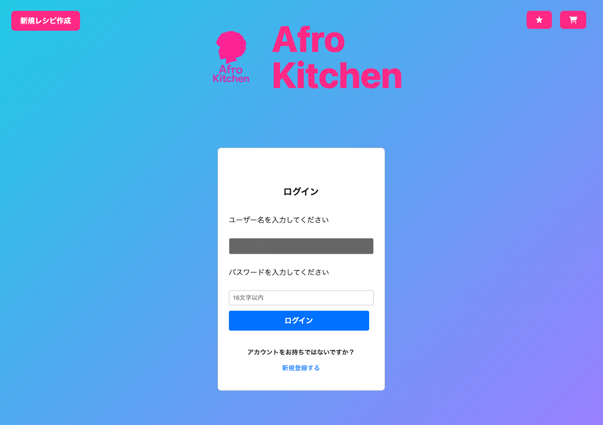
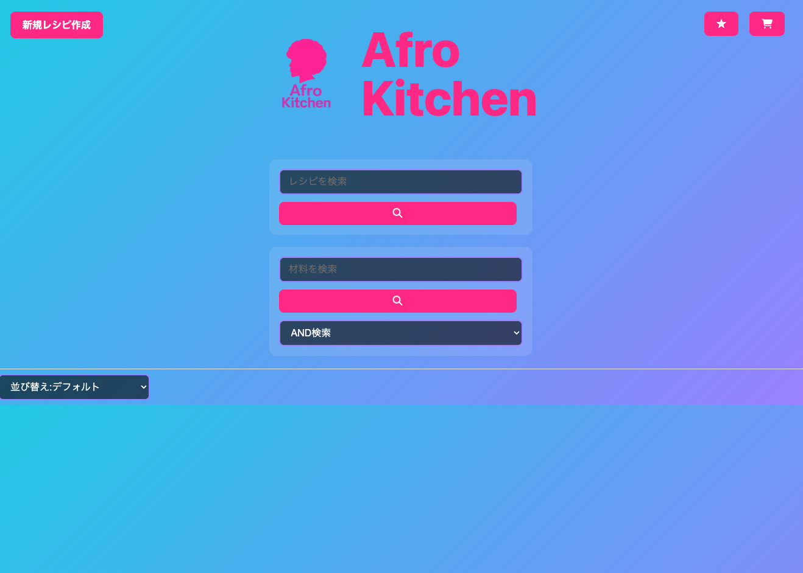
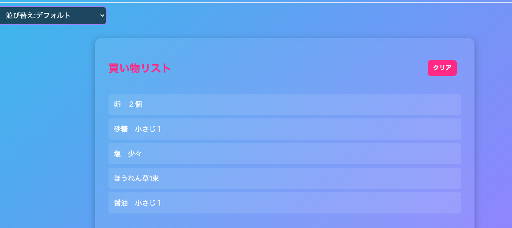
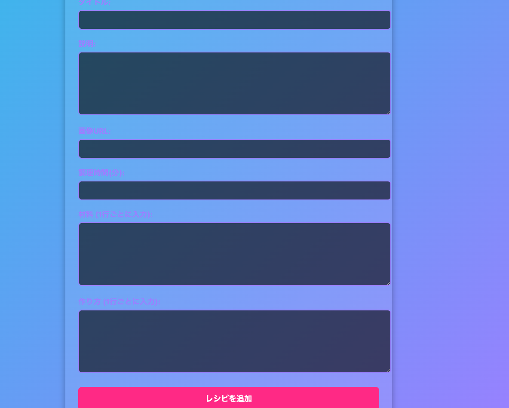

### Afro kitchen

- アプリ URL: https://newrecipe-app-front.onrender.com/
- GitHub リポジトリ: https://github.com/uk-code4610/NEWrecipe-app

---

## スクリーンショット

### ログイン画面

### トップページ

### レシピ詳細

### 買い物リスト

### 新規レシピ登録

## レシピ管理アプリ（React + TypeScript + Flask）

以前開発したレシピ管理アプリ（Flask + JavaScript）を、モダンな技術スタックで全面リニューアルしたプロジェクトです。  
React + TypeScript によるフロントエンド刷新、ユーザー認証機能の追加により、複数ユーザーが自分専用のレシピ管理・お気に入り管理を行えるようになりました。

---

## 開発背景

- ルームシェア中に毎日料理を担当していましたが、ルームメイトが一人暮らしを始めるため「同じレシピを再現したい」と相談を受けました。
- しかし私はレシピを記録していなかったため、再現用にアプリを開発することにしました。

### リニューアルした理由

- 初版（Flask + JS）開発後、フロントエンドへの興味が大きくなった
- React と TypeScript を実践的に学びたかった
- ルームメイトからユーザー認証やお気に入り機能など、追加要望が多数あった

---

## 使用技術

### フロントエンド

- React 18
- TypeScript 5.9.3
- Vite
- Context API（状態管理）

### バックエンド

- Python 3.9
- Flask 3.1.1
  - Flask-CORS
  - Flask-Bcrypt
  - Flask-SQLAlchemy
- SQLite（開発環境）

### インフラ・CI

- Render（デプロイ）
- Pytest（API テスト）

---

## 主な機能

### 基本機能

- レシピ検索（名前・材料）
- AND/OR 切り替え検索
- レシピ詳細表示
- 新規レシピ登録

### 追加機能（リニューアルで追加）

- JWT 認証（登録・ログイン）
- ユーザーごとのお気に入りレシピ
- 買い物リスト生成機能

---

## 学んだこと・工夫点

### 1. 自分の成長がはっきり見えた

数ヶ月前のコードを見返し、設計や変数管理の甘さに気づいた。  
「見直すことで初めて成長を自覚する」経験をした。

### 2. フレームワークの重要性を理解

React のコンポーネント構造により、保守性・拡張性が大きく向上。  
DOM 操作中心だった前作から大幅に改善した。

### 3. 段階的な開発が成功に繋がった

最初に“JS 版の機能移植”を行ったことで、React の理解を固めた状態でログイン機能に移れた。

### 4. TypeScript の恩恵

- レシピ ID（JS では string、Flask では Integer）という型不一致を事前に発見
- `recipeId: number | null` など、正しい状態管理を学べた

### 5. バックエンドを Blueprint で分割

- `app.py` に全て書いていた構成を改善
- `models`, `routes`, `extensions` などに分割し責務を明確化

### 6. localStorage の活用

- お気に入りや買い物リストの永続化
- 今後はサーバー側へ保存する拡張を検討

### 7. データベース設計を学び直し

- 主キー、外部キー、UNIQUE 制約などを理解した上で実装
- SQLAlchemy が裏で何をしているかを理解

### 8. テストコード初実装（pytest）

- API の正常系・異常系をテスト
- “リファクタリングしても壊れていない”という安心感を体験

---

## 苦労した点

### 設計不足による後半の苦労

- Context を作ったあとにログイン機能を追加したため、App.tsx に状態が残ってしまった
- 今後は先に設計図を作る重要性を痛感

### フロントとバックの接続

- CORS、ポート不一致、ヘッダー設定など多くのエラーに遭遇
- ネットワークと HTTP の基礎知識の重要性を理解

### TypeScript の学習

- イベント型
- コンテキストとジェネリクス  
  など最初は苦戦したが、IDE 補完の恩恵を大きく実感

## 今後の展望

### 機能面

- PFC（栄養バランス）計算
- レシピ投稿の拡張

### 技術面

- Next.js の学習
- MySQL を実際に触って理解したい
- Web / HTTP / ネットワークの体系的な学習
- 最初から TypeScript で開発するフローを確立

---

## まとめ

前作をベースに、  
「なぜそう実装するのか」を意識しながら  
実務に近い形でリニューアルを進めたプロジェクトです。

フロント・バックの両方に挑戦し、  
設計・データベース・認証・テストまで幅広く学べた成果になりました。

## 更新履歴

### 2025 年 12 月 10 日

- **面接フィードバックを元に改善**
- ログイン・新規登録にバリデーション追加
- エラーメッセージのスタイル改善（「レシピが見つかりませんでした」「お気に入りが登録されていません」）

### 2025 年 12 月 14 日

- **ユーザーフィードバックを元に改善**
- ログイン時にローディング画面を追加
- レスポンシブ対応（スマホでの背景グラデーション廃止、サイズ調整）
